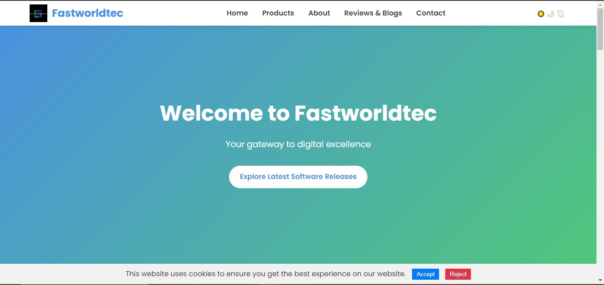

# Fastworldtec



Fastworldtec is a modern affiliate marketing website designed to help users discover and compare various software, courses, themes, and tools. Built with Django for the backend and JavaScript for the frontend, this project offers a dynamic and user-friendly experience.

## Features

- **Dynamic Content Management**: Easily manage and display a variety of affiliate products, including software, courses, themes, and tools.
- **Live Search and Filtering**: Real-time search functionality and filters to help users quickly find relevant products.
- **Theme Switching**: Modern theme switcher to toggle between light, dark, and sepia themes for a customized viewing experience.
- **Responsive Design**: Fully responsive design optimized for different screen sizes and devices..
- **User-friendly Interface**: Intuitive UI with a clean layout and modern CSS design for a seamless user experience.

## Tech Stack

- **Backend**: Django - A high-level Python web framework that encourages rapid development and clean, pragmatic design.
- **Frontend**: JavaScript - For interactive and dynamic features.
- **Database**: MySQL
- **Deployment**: TrueHost, PythonAnywhere

## Installation

To get started with this project, clone the repository and install the required dependencies:

```bash
git clone https://github.com/Jay-Zac/Fastworldtec.git
pip install -r requirements.txt

```
## Usage

Run Migrations:
```bash
python manage.py migrate
```

Start the Development Server:
```bash
python manage.py runserver
```

Access the Application: Open your browser and go to http://127.0.0.1:8000 to view the application.

## Contributing

Contributions are welcome! If you’d like to contribute to this project, please follow these steps:

Fork the repository.
Create a new branch ( ```bash git checkout -b feature-branch ```).
Make your changes.
Commit your changes (```bash git commit -am 'Add new feature' ```).
Push to the branch (```bash git push origin feature-branch ```).
Create a new Pull Request.

## Acknowledgements

Django and the Django community
JavaScript and modern frontend technologies

Fastworldtec is dedicated to providing a seamless and engaging user experience, with a focus on helping users find the best digital products efficiently. Explore the repository to see the full project and join us in delivering digital excellence.
